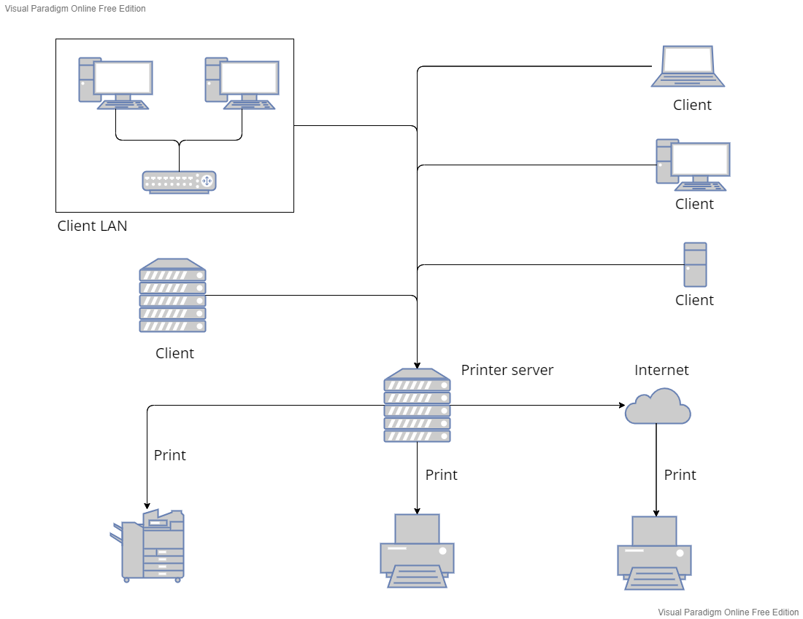

<h1 align="center">Node.js Printer Server</h1>

<p align="center">
  <i>Make you own printer network with a simple software. Connect all your printers into one server</i>
</p>

<p align="center">
  <a href="https://opensource.org/licenses/Apache-2.0">
    
  </a>&nbsp;
  <a>
     
    <!-- v0.6 -->
  </a>&nbsp;
  <a>
    
  </a>
</p>

<hr>

# Test website

## 💡 Help us to improve the project

1. [Issues](https://github.com/ZhengLinLei/node-server-printer/issues)
2. [Contribute](https://github.com/ZhengLinLei/node-server-printer/pulls)

This project was made with the support of those packages:
- [https://github.com/artiebits/pdf-to-printer](https://github.com/artiebits/pdf-to-printer) Windows
- [https://github.com/artiebits/unix-print](https://github.com/artiebits/unix-print) Unix
- [https://www.npmjs.com/package/zuzel-printer](https://www.npmjs.com/package/zuzel-printer) Support package
- [https://github.com/marcbachmann/node-html-pdf](https://github.com/marcbachmann/node-html-pdf) PDF conversor
- [https://github.com/song940/node-escpos](https://github.com/song940/node-escpos) Cash Drawer


## ⚙ How does it work?

This project create a Node server where any device can connect to the web server and print any Printer connected into the server.

**Example schema:**




# 🗺 Roadmap Index

1. [Installation](#installation)
2. [Configuration](#config)
3. [Execution](#exe)
4. [API](#api)
5. [How to print?](#howto)
6. [Open Cash Drawer](#cashdrawer)


## <a name="installation"></a> Installation

Clone the project or download the last release compressed `.rar`
```
git clone https://github.com/ZhengLinLei/node-server-printer.git
```

Once you have downloaded the project, run the `npm` install command:
```
# cd to the project and run this command

npm install


# NPM will download all the packages automatically
```

**Now continue to configurate the project files and personal datas.**


## <a name="config"></a> Configuration

Open the project in your code editor and change some configuration.

### Server configuration

Open the file `./config/server.js` and modify all the values with the correct situation:
```javascript
const SERVER_CONFIG = {
    "name": "node-server-printer",
    // REPLACE TO YOUR DEFAULT PORT
    "port": 3000, // Deploy port :80
    "welcome-text": "Server on port: $port", // Variables: $port, $ip, $domain

    // SERVER OS
    "os": "win32" // Values ["win32", "unix"]
}

module.exports = SERVER_CONFIG;
```

**Note: Please configurate correctly the OS value, or else the server will not work**

### Printer configuration

The system will choose the default values, but you can change it with two ways:

#### - 1. GUI mode:

To access you must go to 'server.domain/config' url or in '/' you can find an acnchor url where if you click it you will be redirected to settings page.

```javascript
/*===============
 ./routes/index.js (7 - 26)
================*/


// Personalizate
router.get('/', (req, res) =>{
    // Replace all here to your project main frontend files
    res.render('index', {
        title: "Welcome!"
    })
});

/* ... */

// Module default
router.get('/config', async (req, res) =>{
    // Get printer list to config
    let def = await Controller.getPrinter();        // Get the Default Printer
    let printers = await Controller.getPrinters();    // Get the list of Printers

    res.render('config', {
        def,
        printers
    });
});
```


#### - 2. Code mode:

Call the controller in `./controllers/controller.js` and call this function:
```javascript
const Controller = require('./controllers/controller'); // Change the patyh according to your position

let param = 'printer'; // Read below to check the parameters accepted
let value = 'NAME_PRINTER';

Controller.setConfig(param, value);
```

Avaliables parameters:
* `printer`: [values] (str:name of the printer)

You can read the avaliables parameters in `./models/model.js` file with or calling it in `Controller` object:
```javascript
const Controller = require('./controllers/controller'); // Change the patyh according to your position

console.log(Controller.DATA_DEFAULT);
```

To get the list of the printers, click [here](#printers-list)


## <a name="exe"></a> Execution

Run the project by calling the `index.js` file with node
```bash
node index.js
# or
npm run start
```

or call it with [Nodemon](https://www.npmjs.com/package/nodemon), so you can save the project and the server will update automatically
```bash
npm run dev
```


Once you have all, open `http://localhost:3000` (change the port if you have changed in the server config file), if you can see the welcome page means you have executed the project succesfully. Continue reading to know the [API](#api) functions


## <a name="api"></a> API

All functions can be modified and added in `./controllers/controller.js` and `./models/model.js`

### - cleanTMP_() => void

Call this function to clean the TMP folder:
```javascript
// ./index.js (43 - 47)

app.listen(app.get('port'), ()=>{
    Controller.cleanTMP_(); // Remove all temporal files
    // Server activated
    console.log(app.get('welcome-text'));
});
```

### - setConfig: (param[str], value[str | boolean]) => boolean

This function update the default options, please read [Configuration](#config) for more information

### - getPrinter() => json [promise]

Call this function to get the default printer
```javascript
const Controller = require('./controllers/controller.js');

// Method 1:
(async function fnc(){
    console.log(await Controller.getPrinter());
})();

// Method 2:
Controller.getPrinter().then(console.log);

// Output { deviceId: 'XP-80C', name: 'XP-80C' }
```


### - <a name="printer-list"></a> getPrinters => json[] [promise]

Same as `getPrinter`, but in this case the function return the array of all printers
```js
const Controller = require('./controllers/controller.js');

// Method 1:
(async function fnc(){
    console.log(await Controller.getPrinters());
})();

// Method 2:
Controller.getPrinters().then(console.log);

// Output 
// [
//   { deviceId: 'XP-80C', name: 'XP-80C' },
//   {
//     deviceId: 'Microsoft XPS Document Writer',
//     name: 'Microsoft XPS Document Writer'
//   },
//   {
//     deviceId: 'Microsoft Print to PDF',
//     name: 'Microsoft Print to PDF'
//   },
//   {
//     deviceId: 'OneNote for Windows 10',
//     name: 'OneNote for Windows 10'
//   },
//   { deviceId: 'Fax', name: 'Fax' }
// ]
```

### - printFile(filename[str], options[json], fnc[function]) => boolean [promise]

To print any file, prepare the print options template
```js
let option = {
    printer: 'Zebra', //[can be declared in GET parameter, if you specify this option, the system will choose this option as first printer]
    pages: "1-3,5", //[The number of page that the client want to print: syntax <num-num> will print the pages from "num" to "num", <num, num> will only print the "num" and "num" pages]
    subset: "odd", //[Will print odd pages only when value is "odd". Will print even pages only when "even"] 
    scale: "fit",
    copies: 1 //[Specifies how many copies will be printed]
    //... [More options in https://github.com/artiebits/pdf-to-printer#printpdf-options--promisevoid]
}
```

And call it:
```js
const Controller = require('./controllers/controller.js');

Controller.printFile('./tmp/file.pdf', {printer: "Fax"}, () =>{
    console.log('Printed!!');
})
```


**Note: All of those functions are for internal calling, for knowing the structure of the server and for helping you to undestand how to modify the source code and personalizate it to create your own version. If you are looking for server API to client print please continue reading**


## <a name="howto"></a> How to print?

The query path is : `server.domain/print/:type/:printer?`

```js
router.post('/print/:type/:printer?', async (req, res) =>{}); // ./routes/index.js (47 ~)
```

### Parameters GET

* :type => Only `file` and `html` argument can be accepted.
    
    * file: Upload any `pdf`, `png`, `jpg` file to print. POST method "file"
    * html: Upload `html` string to print. POST method "html"

**You must specify the type, and in POST content include the data with the name of "file" or "html"**

* :printer => Specify the printer name, optional parameter, if you leave it in blank the system will choose the default printer to print

### Parameters POST

* [file] => FILE content, you must upload this content if you want to print `file` content and you have specified `:type` as file in GET parameters

* [html] => If you choose in `:type` the `html` option, you have to pass this POST content
* [pdfOptions>] => Additionally when you choose `html` type you have to pass the options to convert the HTML into PDF
```javascript

// Example pdfOption
let config = {
    // Export options
    "directory": "/tmp",       // The directory the file gets written into if not using .toFile(filename, callback). default: '/tmp'
    // Papersize Options: http://phantomjs.org/api/webpage/property/paper-size.html
    "height": "10.5in",        // allowed units: mm, cm, in, px
    "width": "8in",            // allowed units: mm, cm, in, px
    //- or -
    "format": "Letter",        // allowed units: A3, A4, A5, Legal, Letter, Tabloid
    "orientation": "portrait", // portrait or landscape
    // Page options
    "border": "0",             // default is 0, units: mm, cm, in, px
    //- or -
    "border": {
        "top": "2in",            // default is 0, units: mm, cm, in, px
        "right": "1in",
        "bottom": "2in",
        "left": "1.5in"
    },
    "paginationOffset": 1,       // Override the initial pagination number
    "header": {
        "height": "45mm",
        "contents": '<div style="text-align: center;">Author: Marc Bachmann</div>'
    },
    "footer": {
        "height": "28mm",
        "contents": {
            "first": 'Cover page',
            2: 'Second page', // Any page number is working. 1-based index
            "default": '<span style="color: #444;">{{page}}</span>/<span>{{pages}}</span>', // fallback value
            "last": 'Last Page'
        }
    },
    // Rendering options
    "base": "file:///home/www/your-asset-path/", // Base path that's used to load files (images, css, js) when they aren't referenced using a host
    // Zooming option, can be used to scale images if `options.type` is not pdf
    "zoomFactor": "1", // default is 1
    // File options
    "type": "pdf",           // allowed file types: png, jpeg, pdf
    "quality": "75",         // only used for types png & jpeg
    //  ... More information in: https://www.npmjs.com/package/html-pdf?activeTab=readme
}
```

* <printOption> => Parameter of the options to print, must be passed in every API call
```javascript

// Example printOptions
let option = {
    printer: 'Zebra', //[can be declared in GET parameter, if you specify this option, the system will choose this option as first printer]
    pages: "1-3,5", //[The number of page that the client want to print: syntax <num-num> will print the pages from "num" to "num", <num, num> will only print the "num" and "num" pages]
    subset: "odd", //[Will print odd pages only when value is "odd". Will print even pages only when "even"] 
    scale: "fit",
    copies: 1 //[Specifies how many copies will be printed]
    //... [More options in https://github.com/artiebits/pdf-to-printer#printpdf-options--promisevoid]
}
```


### API Example Calls

With file `:type`
```

fetch: localhost:3000/file/MyPrinter

GET
<body;

    type = file;

    printer? = MyPrinter;
>


POST
<body;

    file = <file_data: filename.pdf>

    printOptions = {
        copies: 3
    }

>
```


With html `:type`
```
fetch: localhost:3000/html

GET
<body;

    type = file;

    printer? = MyPrinter;
>


POST
<body;

    html = <h1>Hello World!!</h1>

    pdfOptions = {
        format: "A4", 
    }

    printOptions = {
        printer: "MyPrinter"
        copies: 3
    }

>

```


## <a name="cashdrawer"></a> Open Cash Drawer

The query path is : `server.domain/openCashDrawer` in ``GET` method:

Example: JS
```js
fetch('/openCashDrawer')
  .then(response => response.json())
  .then(data => console.log);
```

Configurate it in `./controllers/controllers.js [99-106]`


### Love this repo? Give us a star ⭐

<a href="./">
  
</a>